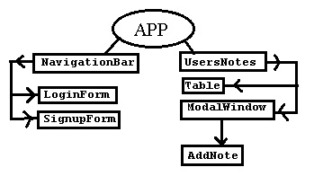

Directory Structure
 -------------------

       client/                      - frontend
       server/                      - backend
       server/public/index.js       - entry point
       

 Stack
-------------------
frontend
- [React]
- [redux]

backend 
- [express]
- [tingodb]

or
- [mongodb]

shema app frontend 
-------------------

shema app backend 
-------------------
- /api/users
- /api/auth
- /api/notes

 
 Install
 -------------------

Clone repo in your directory

> git clone https://github.com/dva22/CRUD_react_todo.git

Install components (need NPM from Node.js)

> npm i --production

execute server http://127.0.0.1:3000/

> npm run server
